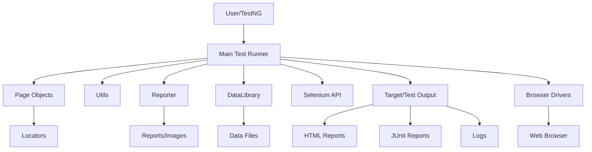

# Selenium Advanced Framework

## Overview
This project is a robust Selenium-based test automation framework designed for advanced web application testing. It leverages Java, TestNG, and Maven, and supports features like data-driven testing, custom reporting, and modular page object design.

## Features
- **Page Object Model (POM):** Organized page classes for maintainable tests.
- **Data-Driven Testing:** Uses external data sources for flexible test scenarios.
- **Custom Reporting:** Generates detailed HTML reports with screenshots.
- **TestNG Integration:** Supports parallel execution, grouping, and test configuration.
- **Reusable Utilities:** Includes helper classes for reporting, data handling, and locators.

## Project Structure
```
pom.xml                # Maven build configuration
testng.xml             # TestNG suite configuration
data/                  # Test data files
reports/               # Generated test reports
src/
  main/java/com/leafBot/
    locators/          # Locator definitions
    pages/             # Page object classes
    selenium/api/      # Selenium API wrappers
    testcases/         # Test case implementations
    testng/            # TestNG customizations
    utils/             # Utility classes
  test/java/           # Test source files
target/                # Build output
```

## Setup Instructions
1. **Prerequisites:**
   - Java JDK 8 or above
   - Maven
   - ChromeDriver/other browser drivers

2. **Clone the Repository:**
   ```bash
   git clone <repo-url>
   ```

3. **Install Dependencies:**
   Maven will handle dependencies via `pom.xml`.
   ```bash
   mvn clean install
   ```

4. **Configure TestNG:**
   Edit `testng.xml` to specify test suites, groups, and parameters.

5. **Add Test Data:**
   Place your data files in the `data/` directory.

## Running Tests
- **Via Maven:**
  ```bash
  mvn test
  ```
- **Via TestNG:**
  Run from IDE or use:
  ```bash
  mvn test -DsuiteXmlFile=testng.xml
  ```

## Reports
- HTML reports are generated in the `reports/` and `test-output/` directories after test execution.
- Screenshots for failed steps are saved in the `images/` subfolders.

## Key Classes
- `LoginPage.java`: Implements login page actions.
- `DataLibrary.java`: Handles test data operations.
- `Reporter.java`: Manages custom reporting.
- `Locator.java`: Centralizes element locators.

## Customization
- Add new page classes in `pages/`.
- Create new test cases in `testcases/`.
- Extend utilities in `utils/`.

## Troubleshooting
- Ensure browser drivers are compatible and available in PATH.
- Check `pom.xml` for dependency issues.
- Review logs and reports in `reports/` and `test-output/` for errors.

## License
Specify your license here (e.g., MIT, Apache 2.0).

## Author
Add your name and contact information here.

## Architecture Diagram

Below is a visual representation of the Selenium Advanced Framework architecture:



---
For detailed documentation, refer to comments in source files and the generated reports.